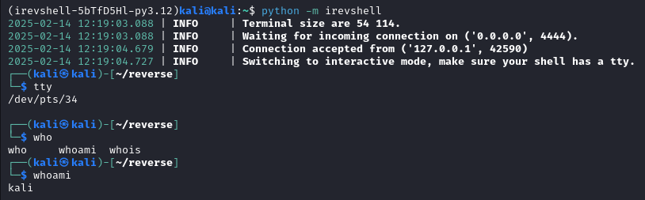
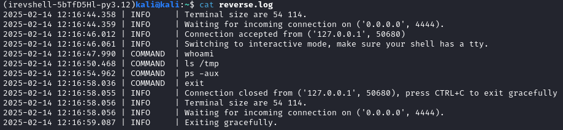
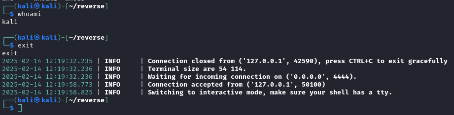

<p align="center">
    <a href="#readme">
        
    </a>
</p>
<p align="center">
    <a href="https://pypi.python.org/pypi/irevshell"></a>
    <a href="https://pypi.python.org/pypi/irevshell"></a>
    <a href="https://github.com/Xenorf/irevshell/blob/main/LICENSE"></a>
</p>
<p align="center">
    <a href="#readme">
        
    </a>
</p>

______________________________________________________________________

💻 **irevshell** is a simple reverse shell listener aimed at professionals who want an almost built-in interactivity and systematic logging.

Did you ever press CTRL+C and accidentally killed your reverse shell? Tired of having to restart your listener when you lose connection? Someone is asking you precisely at what time you ran `rm -rf --no-preserve-root` on their server? You never remember the command to restore your terminal settings after fucking it up with `stty raw -echo`?

**If your answer to any of these questions is yes, welcome.**

## Installation

```
pip install irevshell
```

## Usage

Listen on specific interface and port: `irevshell -i 192.168.1.10 -p 1234`

Connect to bind shell: `irevshell --ip 192.168.1.20 --port 1234 --bind`

Create a listener compatible with [ConPtyShell](https://github.com/antonioCoco/ConPtyShell): `irevshell --conpty`

Important keybinds
* `CTRL+X` switch between dumb and interactive mode, useful after pty spawn (shell upgrade).
* `CTRL+P` in case you forgot to enable ConPty mode, **might create artifacts if you didn't specify terminal size with the client**.

## Features

### Almost built-in interactivity
If the remote connection displays a prompt, interactive mode is enabled. It allows for autocompletion, handling of `CTRL+C`, `CTRL+Z` SIGINT etc. To make sure full interactivity is enabled (sudo commands, file editing with vi etc.), a tty is mandatory. There are tons of ways to ensure that but this command can help you spawn one: `python3 -c 'import pty; pty.spawn("/bin/bash")' || python -c 'import pty; pty.spawn("/bin/bash")' || script -qc /bin/bash /dev/null`.



To put a cherry on top, with the correct parameter (`--conpty` or `-c`) you have [ConPtyShell](https://github.com/antonioCoco/ConPtyShell) support for interactive reverse shells on Windows.

### Systematic logging

By default, every single command made in the reverse shell is logged to a file. The filename and path can be customize as well as the level of debug log. Error traces are verbose in case something goes really wrong.



### Automatic restart, graceful exit and restoration

Exiting a shell or losing the connection will automatically restart the listener. If you want to stop listening to incoming connection, once you have exited any ongoing shell, you can gracefully exit the program by pressing `CTRL+C`. This will restore terminal settings that were changed.



## Credits

Inpired by [this tool](https://github.com/infodox/python-pty-shells/tree/master) from Darren Martyn.  
Upgrade command taken from [IppSec](https://github.com/IppSec/forward-shell/blob/master/forward-shell.py).
